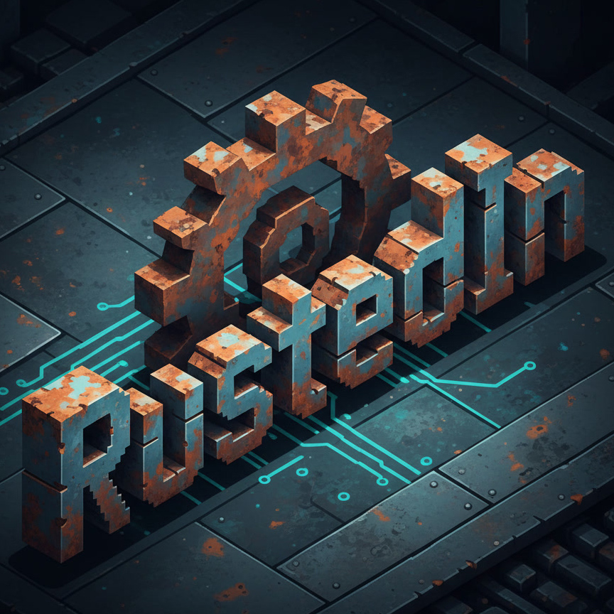

<p align="center">
  
</p>

<h1 align="center">rustedin</h1>

<p align="center">
  Multi-account social CLI — publish to LinkedIn, Facebook Pages and Instagram from a single binary.
</p>

<p align="center">
  <a href="https://github.com/z29k/rustedin/actions/workflows/ci.yml"></a>
  <a href="https://github.com/z29k/rustedin/releases"></a>
  <a href="LICENSE"></a>
  
</p>

<p align="center">
  <b>English</b> · <a href="README.fr.md">Français</a>
</p>

---

## Table of contents

- [Features](#features)
- [Installation](#installation)
- [Quick start](#quick-start)
  - [LinkedIn](#linkedin)
  - [Meta — Facebook and Instagram](#meta--facebook-and-instagram)
  - [First posts](#first-posts)
- [Migrating from 1.x](#migrating-from-1x)
- [Command reference](#command-reference)
  - [Global options](#global-options)
  - [`accounts`](#accounts)
  - [`status`](#status)
  - [`migrate`](#migrate)
  - [`broadcast`](#broadcast)
  - [`linkedin setup`](#linkedin-setup)
  - [`linkedin auth`](#linkedin-auth)
  - [`linkedin accounts` / `linkedin status`](#linkedin-accounts--linkedin-status)
  - [`linkedin post`](#linkedin-post)
  - [`linkedin reshare`](#linkedin-reshare)
  - [`linkedin share`](#linkedin-share)
  - [`linkedin get-post`](#linkedin-get-post)
  - [`linkedin comments`](#linkedin-comments)
  - [`linkedin profile`](#linkedin-profile)
  - [`meta setup`](#meta-setup)
  - [`meta auth`](#meta-auth)
  - [`meta token`](#meta-token)
  - [`meta accounts` / `meta status`](#meta-accounts--meta-status)
  - [`meta pages`](#meta-pages)
  - [`meta use`](#meta-use)
  - [`meta get`](#meta-get)
  - [`facebook post`](#facebook-post)
  - [`facebook photo`](#facebook-photo)
  - [`facebook video`](#facebook-video)
  - [Instagram — shared options](#instagram--shared-options)
  - [`instagram post`](#instagram-post)
  - [`instagram reel`](#instagram-reel)
  - [`instagram story`](#instagram-story)
  - [`instagram publish`](#instagram-publish)
  - [`instagram limit`](#instagram-limit)
- [Visibility (`--visibility`)](#visibility---visibility)
- [How media works](#how-media-works)
- [Configuration file (`rustedin.json`)](#configuration-file-rustedinjson)
- [Token management](#token-management)
- [Building a single-platform binary](#building-a-single-platform-binary)
- [Limitations](#limitations)
- [Common errors](#common-errors)
- [Exit codes](#exit-codes)
- [Contributing](#contributing)
- [Security](#security)
- [License](#license)

---

## Features

- **Three platforms, one binary** — LinkedIn personal accounts and company
  pages, Facebook Pages, Instagram Professional accounts.
- **Multi-account** — as many accounts as you want, each behind a short alias,
  namespaced per platform so the same alias can name a LinkedIn page *and* a
  Meta account.
- **Cross-posting** — [`broadcast`](#broadcast) sends one piece of content to
  every platform at once, in parallel, with a per-target report and a
  `--dry-run`.
- **LinkedIn** — text posts, article shares (link card or full-size image),
  fan-out reshares, read helpers for posts, comments and profiles.
- **Facebook Pages** — text and link posts, single and multi-photo posts,
  videos, all schedulable up to 75 days ahead.
- **Instagram** — feed posts, 2–10 item carousels, Reels and Stories, including
  local files that Instagram's API cannot accept directly.
- **Automatic token renewal** — LinkedIn access tokens are refreshed 7 days
  before expiry; Meta user tokens are re-exchanged in the same window.
- **Built to be scripted** — one JSON document on stdout, everything else on
  stderr, and a non-zero exit on any error.
- **Retries that cannot double-publish** — rate limits and server errors are
  retried with exponential backoff, but a publish is never repeated after a
  failure that might already have gone through.

---

## Installation

### Prebuilt binary

Download the archive for your platform from the
[releases page](https://github.com/z29k/rustedin/releases), extract it, and put
`rustedin` somewhere on your `PATH`.

### From source

```bash
git clone https://github.com/z29k/rustedin.git
cd rustedin

# Optimized release build → target/release/rustedin
cargo build --release

# Or install straight into ~/.cargo/bin (available everywhere as `rustedin`)
cargo install --path .
```

Requires Rust 1.74 or later. To build with only one platform compiled in, see
[Building a single-platform binary](#building-a-single-platform-binary).

---

## Quick start

Configure only the platforms you need — LinkedIn and Meta are independent.

### LinkedIn

#### Step 1 — Create the LinkedIn apps

LinkedIn requires **two separate apps** (platform restriction: the "Community
Management API" must be the *only* active product on its app).

**App for personal accounts**

1. [linkedin.com/developers/apps](https://www.linkedin.com/developers/apps) → **Create App**
2. Enable the products:
   - **Share on LinkedIn**
   - **Sign In with LinkedIn using OpenID Connect**
3. **Auth** tab → add `http://localhost:8765/callback` as a **Redirect URL**
4. Copy the **Client ID** and **Client Secret**

**App for company pages**

1. [linkedin.com/developers/apps](https://www.linkedin.com/developers/apps) → **Create App** (a second app)
2. Enable the product:
   - **Community Management API**
3. **Auth** tab → add `http://localhost:8765/callback` as a **Redirect URL**
4. Copy the **Client ID** and **Client Secret**

#### Step 2 — Configure the apps

```bash
rustedin linkedin setup --app=personal     --client-id=PERSONAL_CLIENT_ID --client-secret=PERSONAL_CLIENT_SECRET
rustedin linkedin setup --app=organization --client-id=ORG_CLIENT_ID      --client-secret=ORG_CLIENT_SECRET
```

#### Step 3 — Authenticate each account

```bash
# Personal account
rustedin linkedin auth --account=quentin

# Company page (the page admin must log in)
rustedin linkedin auth --account=my-company --org-id=YOUR_ORG_ID
```

> The **org-id** is found in the company page URL: `linkedin.com/company/MY_ORG_ID/`
>
> For a company account, the person who logs in **must be an admin of the page**.

### Meta — Facebook and Instagram

One Facebook Login covers both platforms: the Page tokens it yields publish to
Facebook Pages, and each Page carries the ID of the Instagram Professional
account linked to it.

#### Step 1 — Create the Meta app

1. Go to [developers.facebook.com/apps](https://developers.facebook.com/apps)
   and create an app of type **Business**.
2. Add the **Facebook Login** product. Under *Facebook Login → Settings*, add
   this to **Valid OAuth Redirect URIs**, verbatim:

   ```
   http://localhost:8765/callback
   ```

   > Meta only accepts `http://localhost` while the app is in **Development**
   > mode. Once the app goes Live the redirect URI must be HTTPS — use
   > `--redirect-uri` with a tunnel, and register that URI instead.

3. Add the **Instagram** product if you intend to publish to Instagram.
4. Copy the **App ID** and **App Secret** from *Settings → Basic*.

Requirements on the accounts themselves:

- the authenticating user must have a role on each Facebook Page;
- each Instagram account must be a **Professional** account (Business or
  Creator) and be **linked to a Facebook Page** in Meta Business Suite.

While the app is in Development mode, everything works for users who have a
role on the app. Going Live requires App Review for `pages_manage_posts` and
`instagram_content_publish`.

#### Which authentication path is yours

Business apps ship **Facebook Login for Business**, which is built for a tech
provider authorizing a *client's* assets. That distinction decides how you
authenticate, and picking the wrong path costs an afternoon:

| Whose Pages do you publish to? | Command | Why |
| ------------------------------ | ------- | --- |
| **Your own** (you own the app *and* the Pages) | [`meta token`](#meta-token) | Login for Business refuses to delegate assets to the portfolio that owns the app, so `auth` has no path at all — the asset picker greys that portfolio out |
| **Your clients'** (you are a tech provider) | [`meta auth`](#meta-auth) with `--config-id` | The standard delegation flow |

Publishing to your own Pages is the common case, and it skips OAuth entirely:
mint a system user token as described under [`meta token`](#meta-token) and jump
to [First posts](#first-posts). The rest of this section covers the client flow.

> For the client flow, create the configuration under *Facebook Login for
> Business → Configurations* — [`config_id` has replaced `scope`](https://developers.facebook.com/docs/facebook-login/facebook-login-for-business),
> and without one Meta grants the permissions but attaches no Page at all,
> leaving `/me/accounts` empty. Set the token type to **System user**, not User:
> Meta only shows the portfolio-and-asset picker for system user
> configurations, the ones granting *"continuous access to business assets, such
> as Facebook Pages, ad accounts or Instagram accounts"*.

#### Step 2 — Configure the app

```bash
rustedin meta setup --app-id=1234567890 --app-secret=abcdef... --config-id=9876543210
```

`--config-id` is optional: omit it on apps using the classic Facebook Login,
where `auth` requests the default scopes instead.

#### Step 3 — Authenticate

```bash
rustedin meta auth --account=z29k
```

Your browser opens the Meta consent screen; rustedin waits for the callback on
`http://localhost:8765`, exchanges the code for a long-lived token, and stores
every Page you administer along with its linked Instagram account.

```bash
rustedin meta pages --account=z29k
```

### First posts

```bash
# LinkedIn
rustedin linkedin post --account=quentin --text="My first post via rustedin!"

# Facebook
rustedin facebook post --account=z29k --message="Hello from rustedin"

# Instagram
rustedin instagram post --account=z29k --media=./photo.jpg --caption="Hello 👋"

# All three at once
rustedin broadcast \
  --to=linkedin:quentin,facebook:z29k,instagram:z29k \
  --text="Hello from every platform" \
  --image=./photo.jpg
```

---

## Migrating from 1.x

rustedin 2.0 groups every command under its platform, and namespaces the config
file so a LinkedIn alias and a Meta alias can share a name.

**Commands** — each 1.x command moves under `linkedin` (the group also answers
to `li`):

| 1.x | 2.0 |
|-----|-----|
| `rustedin setup --app=…` | `rustedin linkedin setup --app=…` |
| `rustedin auth --account=…` | `rustedin linkedin auth --account=…` |
| `rustedin accounts` | `rustedin linkedin accounts`, or `rustedin accounts` for every platform |
| `rustedin status` | `rustedin linkedin status`, or `rustedin status` for every platform |
| `rustedin post` | `rustedin linkedin post` |
| `rustedin reshare` | `rustedin linkedin reshare` |
| `rustedin share` | `rustedin linkedin share` |
| `rustedin get-post` | `rustedin linkedin get-post` |
| `rustedin comments` | `rustedin linkedin comments` |
| `rustedin profile` | `rustedin linkedin profile` |

**Config** — a 1.x `rustedin.json` is upgraded automatically the first time
2.0 reads it. There is nothing to do by hand.

**Coming from `rustameta`** — fold its config into this one, tokens and all:

```bash
rustedin migrate --from /path/to/rustameta.json
```

---

## Command reference

Every command prints **one JSON document on stdout**. Progress, warnings and
request traces go to stderr, so `rustedin … | jq` never sees a log line.

### Global options

| Option | Description |
|--------|-------------|
| `--config <PATH>` | Config file to use. Defaults to `rustedin.json` next to the binary |
| `--api-version <V>` | Graph API version, e.g. `v25.0`. Meta only |
| `--help`, `--version` | The usual |

Global options are accepted **anywhere** on the line — before the platform
group, after it, or after the subcommand:

```bash
rustedin --config=/etc/rustedin.json facebook post --account=z29k --message="…"
rustedin facebook post --account=z29k --message="…" --config=/etc/rustedin.json
```

Platform groups accept short aliases: `li`, `fb`, `ig`.

Every Facebook and Instagram command takes `--account` and `--page`. `--page` is
optional when the account has a single Page or a default pinned with
[`meta use`](#meta-use); it accepts a Page ID, an exact name, or a unique
case-insensitive fragment of one.

---

### `accounts`

Every configured account, grouped by platform.

```bash
rustedin accounts
```

```json
{
  "linkedin": [
    {
      "platform": "linkedin",
      "alias": "quentin",
      "type": "person",
      "urn": "urn:li:person:xxxx",
      "access_token_status": "active",
      "access_token_expires_in_days": 52,
      "access_token_expires_on": "2026-10-23",
      "refresh_token_expires_in_days": 341,
      "refresh_token_expires_on": "2027-08-08",
      "needs_reauth": false
    }
  ],
  "meta": [
    {
      "platform": "meta",
      "alias": "z29k",
      "user_id": "1220000000000000",
      "name": "Quentin Mathis",
      "user_token_status": "active",
      "user_token_expires_in_days": 3649,
      "user_token_expires_on": "2036-08-28",
      "needs_reauth": false,
      "pages": 1,
      "instagram_accounts": 1,
      "scopes": ["pages_show_list", "pages_manage_posts", "..."]
    }
  ]
}
```

### `status`

The same information, keyed by alias, per platform.

```bash
rustedin status
rustedin status --check   # also validates Meta tokens against /debug_token
```

### `migrate`

Fold another config file into this one. Written for the 1.x → 2.0 move: point it
at a `rustameta.json` and its app credentials and accounts land under the `meta`
key. A 1.x `rustedin.json` works just as well.

| Option | Required | Description |
|--------|----------|-------------|
| `--from <PATH>` | yes | Config file to import. It is never modified |
| `--force` | no | Overwrite accounts and credentials that already exist here |

```bash
rustedin migrate --from ~/rustameta.json
```

```json
{
  "success": true,
  "from": "/Users/me/rustameta.json",
  "into": "/usr/local/bin/rustedin.json",
  "imported_accounts": ["meta:z29k"],
  "imported_app_credentials": ["meta"],
  "skipped_accounts": []
}
```

Without `--force`, an account that already exists is listed under
`skipped_accounts` and left untouched.

### `broadcast`

One piece of content, several platforms, published in parallel.

| Option | Required | Description |
|--------|----------|-------------|
| `--to <TARGETS>` | yes | Comma-separated `platform:account[/page]` targets |
| `--text <TEXT>` | no | LinkedIn commentary, Facebook message, Instagram caption |
| `--image <PATH\|URL>` | no | Local path or public URL. **Required** for an Instagram target |
| `--link <URL>` | no | URL to attach |
| `--title <TITLE>` | no | Title where a platform needs one. Defaults to the first line of `--text` |
| `--visibility <V>` | no | LinkedIn audience. Default `PUBLIC` |
| `--schedule <WHEN>` | no | Facebook only. Unix timestamp or ISO 8601 date |
| `--alt-text <TEXT>` | no | Instagram only |
| `--cleanup-relay` | no | Delete the temporary Facebook photos used to relay local images |
| `--dry-run` | no | Print what each target would publish, and publish nothing |

A target names a platform, an account alias, and — for Facebook and Instagram —
an optional Page:

```
linkedin:quentin          li:quentin
facebook:z29k             fb:z29k/My Page
instagram:z29k            ig:z29k
```

The same content maps onto what each platform actually accepts:

| | text only | + image | + link |
|---|---|---|---|
| **LinkedIn** | text post | image post | article card (the image becomes its thumbnail) |
| **Facebook** | feed post | photo post | link preview (URL moves into the caption on a photo post) |
| **Instagram** | *refused* | feed post | appended to the caption as plain text |

> **Why Instagram gets plain text.** The Content Publishing API exposes no link
> field at all: a container takes `image_url` / `video_url`, `media_type`,
> `caption` and a handful of flags, and nothing that attaches a URL. Instagram
> also does not turn a caption URL into a hyperlink — deliberately, to keep
> people in the app. Since March 2026 it has been testing clickable captions for
> Meta Verified professional creators, but only in the mobile app and not
> through the API. So rustedin appends the URL and warns; there is no other
> option.

```bash
rustedin broadcast \
  --to=linkedin:quentin,linkedin:z29k,facebook:z29k,instagram:z29k \
  --text="New article on the blog" \
  --link=https://z29k.fr/blog/rustedin \
  --image=./cover.jpg
```

```json
{
  "total": 4,
  "succeeded": 3,
  "failed": 1,
  "results": [
    { "target": "linkedin:quentin", "success": true, "platform": "linkedin",
      "kind": "article", "post_id": "urn:li:share:7123", "image_urn": "urn:li:image:C1" },
    { "target": "facebook:z29k", "success": true, "platform": "facebook",
      "kind": "photo", "post_id": "1111_2222",
      "permalink": "https://www.facebook.com/1111_2222" },
    { "target": "instagram:z29k", "success": false,
      "error": "POST /media: Graph API 400 — ... [code 9004]" }
  ]
}
```

Failures are per target: one refusal never cancels the others. The process
exits `1` if **any** target failed, so a partial failure is never silent.

Options a target cannot honour are warned about on stderr rather than
rejected — `--schedule` on a LinkedIn target, a `--link` on Instagram. The one
hard refusal is an Instagram target with no `--image`, which is checked before
anything is published.

---

### `linkedin setup`

Store the credentials of one of the two LinkedIn apps.

| Option | Required | Description |
|--------|----------|-------------|
| `--app <TYPE>` | yes | `personal` or `organization` |
| `--client-id <ID>` | yes | App Client ID |
| `--client-secret <SECRET>` | yes | App Client Secret |

```bash
rustedin linkedin setup --app=personal --client-id=86xxxx --client-secret=WPL_AP1.xxxx
```

Partial update: only the credentials of the given app type change, so the two
apps are configured independently and either can be re-run to rotate a secret.

### `linkedin auth`

OAuth 2.0 with an automatic browser flow and a local callback listener.

| Option | Required | Description |
|--------|----------|-------------|
| `--account <ALIAS>` | yes | Alias to store the account under |
| `--org-id <ID>` | no | Organization ID — makes it a company page |
| `--port <PORT>` | no | Callback port. Default `8765` |

```bash
rustedin linkedin auth --account=quentin
rustedin linkedin auth --account=z29k --org-id=107692414
```

Scopes requested:

| Account type | Scopes |
|--------------|--------|
| Personal | `w_member_social openid profile email` |
| Organization | `r_organization_social w_organization_social` |

The account type is inferred from `--org-id`: present → `organization`, using
the organization app's credentials; absent → `person`, using the personal
app's.

> **Why not `openid profile email` for an organization?** LinkedIn requires the
> **Community Management API** to be the *only* product on its app. The
> `openid profile email` scopes come from *Sign In with LinkedIn using OpenID
> Connect*, which therefore cannot be added — requesting them raises
> `unauthorized_scope_error`. That is also why an organization account has no
> "own profile" to read.

The flow: the browser opens the LinkedIn authorization page (or the URL is
printed), rustedin listens on `http://localhost:<port>/callback` for **5
minutes**, exchanges the code for tokens, resolves the URN — from `/v2/userinfo`
for a personal account, directly from `--org-id` for an organization — and
stores everything in `rustedin.json`.

### `linkedin accounts` / `linkedin status`

The LinkedIn slice of the root [`accounts`](#accounts) and [`status`](#status)
commands, printed on its own.

### `linkedin post`

Publish a text post.

| Option | Required | Description |
|--------|----------|-------------|
| `--account <ALIAS>` | yes | Account to post as |
| `--text <TEXT>` | yes | Up to 3000 characters |
| `--visibility <V>` | no | See [Visibility](#visibility---visibility). Default `PUBLIC` |

```bash
rustedin linkedin post --account=quentin --text="Hello LinkedIn 👋"
```

```json
{
  "success": true,
  "platform": "linkedin",
  "post_id": "urn:li:share:7123456789",
  "account": "quentin",
  "urn": "urn:li:person:xxxx",
  "visibility": "PUBLIC",
  "text_preview": "Hello LinkedIn 👋"
}
```

### `linkedin reshare`

Reshare an existing post from one or several accounts, concurrently.

| Option | Required | Description |
|--------|----------|-------------|
| `--post-id <URN>` | yes | Post to reshare, e.g. `urn:li:share:7123456789` |
| `--accounts <A,B>` | yes | Comma-separated aliases, or `*` for every personal account |
| `--commentary <TEXT>` | no | Comment above the reshare |
| `--visibility <V>` | no | Default `PUBLIC` |

```bash
# Reshare from every personal account
rustedin linkedin reshare --post-id=urn:li:share:7123456789 --accounts="*"

# From specific accounts, with a comment
rustedin linkedin reshare --post-id=urn:li:share:7123456789 \
  --accounts=quentin,z29k --commentary="Worth a read"
```

### `linkedin share`

Share an external article or URL.

| Option | Required | Description |
|--------|----------|-------------|
| `--account <ALIAS>` | yes | Account to post as |
| `--url <URL>` | yes | Article URL |
| `--title <TITLE>` | yes | Up to 400 characters |
| `--description <TEXT>` | no | Used as the commentary when `--commentary` is absent |
| `--commentary <TEXT>` | no | Personal comment above the article |
| `--visibility <V>` | no | Default `PUBLIC` |
| `--image <PATH\|URL>` | no | Local file or URL, max 10 MB |
| `--mode <MODE>` | no | `article` (link card, default) or `image` (full-size image) |

```bash
# Simple share (no image)
rustedin linkedin share --account=quentin \
  --url=https://z29k.fr/blog/rustedin --title="rustedin 2.0"

# Full-size image mode
rustedin linkedin share --account=quentin \
  --url=https://z29k.fr/blog/rustedin --title="rustedin 2.0" \
  --image=./cover.jpg --mode=image
```

In `article` mode the image becomes the thumbnail of the link card. In `image`
mode the image fills the post and the URL is appended to the text — LinkedIn
does not render a card there.

### `linkedin get-post`

Retrieve a post by its URN, to check what LinkedIn actually stored.

```bash
rustedin linkedin get-post --account=quentin --post-id=urn:li:share:7123456789
```

### `linkedin comments`

| Option | Required | Description |
|--------|----------|-------------|
| `--account <ALIAS>` | yes | Account used to authenticate |
| `--post-id <URN>` | yes | `urn:li:share:…`, `urn:li:activity:…` or `urn:li:ugcPost:…` |
| `--count <N>` | no | 1–100. Default `20` |
| `--start <N>` | no | Pagination offset. Default `0` |

### `linkedin profile`

Your own profile, or another member's.

| Option | Required | Description |
|--------|----------|-------------|
| `--account <ALIAS>` | yes | Account used to authenticate |
| `--urn <URN>` | no | Another member's URN. Omit for your own profile |

Organization accounts have no `openid` scope — the Community Management API
must be the only product on that app — so they can only look up a member by
URN, never their "own" profile.

---

### `meta setup`

| Option | Required | Description |
|--------|----------|-------------|
| `--app-id <ID>` | yes | Meta App ID |
| `--app-secret <SECRET>` | yes | Meta App Secret |
| `--config-id <ID>` | no | Facebook Login for Business configuration ID |

### `meta auth`

| Option | Required | Default | Description |
|--------|----------|---------|-------------|
| `--account <ALIAS>` | yes | — | Alias to store the account under |
| `--port <PORT>` | no | `8765` | Port for the local callback server |
| `--redirect-uri <URI>` | no | `http://localhost:<port>/callback` | Override the redirect URI (HTTPS tunnel for a Live app) |
| `--scopes <A,B>` | no | see below | Comma-separated scopes to request instead of the defaults |
| `--config-id <ID>` | no | the stored one | Login for Business configuration ID, sent in place of `scope` |
| `--no-browser` | no | `false` | Print the authorization URL instead of opening a browser |

Default scopes:

```
pages_show_list, pages_read_engagement, pages_manage_posts,
instagram_basic, instagram_content_publish
```

The flow: authorization code → short-lived token → long-lived token (~60 days)
→ `/me` → `/me/permissions` → `/me/accounts` (Pages, Page tokens, linked
Instagram accounts). The callback server times out after 5 minutes.

### `meta token`

Adopt an access token minted outside the login flow. Use this when you own both
the app and the assets: Facebook Login for Business refuses to delegate assets
to the portfolio that owns the app, so [`meta auth`](#meta-auth) cannot serve
that case at all. Mint a **system user** token instead.

In *Business settings → Users → System users*, add one, then **Add assets three
times over** — the app is as necessary as the Pages, and forgetting it is what
produces an empty permission list at token generation time:

1. **Apps** → your app, as *Developer* or *Admin* — this is what makes any
   permission available to tick
2. **Pages** → your Page, with full control
3. **Instagram accounts** → your account

Then *Generate token*, choosing the app, an expiry of **Never**, and the scopes
listed under [`meta auth`](#meta-auth). System user tokens do not expire, so
this is a one-off.

| Option | Required | Description |
|--------|----------|-------------|
| `--account <ALIAS>` | yes | Alias to store the account under |
| `--token <TOKEN>` | no | The token. Omit to read it from stdin |

```bash
rustedin meta token --account=z29k              # paste the token, then Ctrl-D
pbpaste | rustedin meta token --account=z29k    # or pipe it in
```

Omitting `--token` keeps the secret out of your shell history.

### `meta accounts` / `meta status`

The Meta slice of the root commands. `meta status --check` additionally asks
`/debug_token` whether each token is still valid, and returns Meta's answer
verbatim under `debug_token`.

### `meta pages`

| Option | Required | Description |
|--------|----------|-------------|
| `--account <ALIAS>` | yes | Account alias |
| `--refresh` | no | Re-fetch the Pages from Meta instead of reading the stored ones |

Run it with `--refresh` after linking a new Instagram account to a Page, or
after being given a role on a new Page.

### `meta use`

Pin the default Page of an account, so publishing commands can skip `--page`.

```bash
rustedin meta use --account=z29k --page="My Page"
rustedin meta use --account=z29k              # clears the default
```

`--page` accepts a Page ID, an exact name, or a unique case-insensitive
fragment of a name.

### `meta get`

Raw Graph API read — the escape hatch for anything rustedin does not wrap.

```bash
rustedin meta get --account=z29k --path=/me/accounts --query=fields=id,name
```

Uses the Page token when a Page is in play, the user token otherwise.

---

### `facebook post`

Text and/or link post on a Page. At least one of `--message` / `--link` is
required.

| Option | Required | Description |
|--------|----------|-------------|
| `--account <ALIAS>` | yes | Account alias |
| `--page <ID\|NAME>` | no | Page to publish to. Optional with a single Page or a pinned default |
| `--message <TEXT>` | no | Post text |
| `--link <URL>` | no | URL to attach as a link preview |
| `--schedule <WHEN>` | no | Unix timestamp or ISO 8601 date, 10 min to 75 days ahead |
| `--draft` | no | Create the post unpublished |

```bash
rustedin facebook post --account=z29k --message="Hello" --link=https://z29k.fr
```

### `facebook photo`

One photo, or several in a single post. Repeat `--image` for a multi-photo post,
which uploads each photo unpublished and stitches them together with
`attached_media`.

| Option | Required | Description |
|--------|----------|-------------|
| `--image <PATH\|URL>` | yes | Repeatable |
| `--message <TEXT>` | no | Post text (the caption for a single photo) |
| plus | | `--account`, `--page`, `--schedule`, `--draft` |

### `facebook video`

| Option | Required | Description |
|--------|----------|-------------|
| `--video <PATH\|URL>` | yes | Local path or public URL |
| `--title <TITLE>` | no | Video title |
| `--description <TEXT>` | no | Video description |
| plus | | `--account`, `--page`, `--schedule`, `--draft` |

---

### Instagram — shared options

Every Instagram publishing command takes these, on top of `--account` and
`--page`:

| Option | Description |
|--------|-------------|
| `--caption <TEXT>` | Up to 2200 characters |
| `--media-type <KIND>` | `image` or `video`, when the extension is ambiguous |
| `--alt-text <TEXT>` | Accessibility text (images only) |
| `--location-id <ID>` | Facebook location Page ID to tag |
| `--collaborators <A,B>` | Instagram usernames to invite as collaborators |
| `--cover-url <URL>` | Public URL of a custom video cover |
| `--thumb-offset <MS>` | Milliseconds into the video to use as the thumbnail |
| `--ai-generated` | Flag the post as AI-generated |
| `--cleanup-relay` | Delete the relay photos once the post is live |

### `instagram post`

A feed post.

| Option | Required | Description |
|--------|----------|-------------|
| `--media <PATH\|URL>` | yes | Local path or public URL; **repeatable** (2–10 → carousel) |

Two or more `--media` make a carousel; the alias `instagram carousel` reads
better when that is the intent.

```bash
rustedin instagram post --account=z29k --media=./photo.jpg --caption="Hello 👋"

rustedin instagram post --account=z29k \
  --media=./1.jpg --media=./2.jpg --media=./3.jpg \
  --caption="Carousel 📸" --cleanup-relay
```

A video passed to `instagram post` is published as a Reel — that is Instagram's
own behaviour, not a rustedin choice.

### `instagram reel`

Same as above with a single `--media`, which must be a video.

### `instagram story`

A 24-hour Story, one `--media`. `--share-to-feed` also pushes it to the main
feed.

### `instagram publish`

Publish a container that was already created — the recovery path when
processing outlasted the poll timeout.

```bash
rustedin instagram publish --account=z29k --creation-id=17900000000000000
```

### `instagram limit`

The content publishing quota for the rolling 24-hour window. Meta allows 100
API-published posts; **a carousel counts as one**.

---

## Visibility (`--visibility`)

LinkedIn only. Available on `linkedin post`, `linkedin reshare`,
`linkedin share` and `broadcast`.

| Value | Description |
|-------|-------------|
| `PUBLIC` | Visible to everyone **(default)** |
| `CONNECTIONS` | Visible only to 1st-degree connections |
| `LOGGED_IN` | Visible only to logged-in LinkedIn members |

> The value is **case-insensitive**: `connections`, `Connections` and
> `CONNECTIONS` are equivalent.

---

## How media works

The three platforms accept media very differently, and this is the single
biggest source of confusion.

| Input | LinkedIn | Facebook | Instagram |
|-------|----------|----------|-----------|
| Public URL (image) | **Downloaded** by rustedin, then uploaded | Sent as `url`, fetched by Meta | Sent as `image_url`, fetched by Meta |
| Public URL (video) | *not supported* | Sent as `file_url`, fetched by Meta | Sent as `video_url`, fetched by Meta |
| Local file (image) | Uploaded to `/rest/images` | Uploaded as multipart `source` | **Relayed** through the Page — see below |
| Local file (video) | *not supported* | Uploaded as multipart `source` | Resumable upload to `rupload.facebook.com` |

**LinkedIn only takes bytes.** Its upload endpoint has no "fetch this URL" mode,
so a remote `--image` is downloaded first and forwarded.

**The Instagram relay.** Instagram is the mirror image: it has no endpoint that
accepts image bytes at all — a container can only point at a URL. So when you
pass a local image, rustedin uploads it to the linked Facebook Page as an
**unpublished** photo, reads back its CDN URL, and feeds that to the container.
Those relay photos stay in the Page's photo library; their IDs are reported in
the command output as `relay_photo_ids`, and `--cleanup-relay` deletes them once
the post is live.

Everything Instagram ingests must be **public, HTTPS, and free of redirects or
authentication** — Meta's fetcher does not carry your credentials. Instagram
also officially supports **JPEG only** for images; rustedin warns on anything
else rather than refusing outright, because Meta sometimes transcodes.

Size ceilings enforced locally (each platform enforces the real ones
server-side):

| Endpoint | Ceiling |
|----------|---------|
| LinkedIn image | 10 MB |
| Facebook photo | 25 MB |
| Facebook video | 1 GB |
| Instagram image | 8 MB |
| Instagram video | 1 GB |

Media types are inferred from the file extension. For extension-less URLs —
common with CDNs and signed links — pass `--media-type=image|video`.

---

## Configuration file (`rustedin.json`)

### Location

| Method | Path |
|--------|------|
| Default | `rustedin.json` next to the binary (portable) |
| Override | `rustedin --config /path/to/rustedin.json <command>` |

Created automatically, written `0600` on Unix. A **malformed** file is an error
rather than a silent reset: overwriting it would destroy the only copy of your
tokens.

### Schema

Each platform owns a key, so the same alias can name a LinkedIn company page and
a Meta account without colliding. Keys rustedin does not know about are
preserved verbatim on save.

```json
{
  "linkedin": {
    "app": {
      "personal":     { "client_id": "...", "client_secret": "..." },
      "organization": { "client_id": "...", "client_secret": "..." }
    },
    "accounts": {
      "<alias>": {
        "alias": "string",
        "type": "person | organization",
        "urn": "string | null",
        "person_urn": "string | null",
        "access_token": "string",
        "refresh_token": "string",
        "expires_at": "number (Unix ms)",
        "refresh_expires_at": "number (Unix ms)"
      }
    }
  },
  "meta": {
    "app": {
      "app_id": "1234567890",
      "app_secret": "...",
      "config_id": "9876543210"
    },
    "accounts": {
      "<alias>": {
        "alias": "string",
        "user_id": "10000000000000",
        "name": "Quentin Mathis",
        "access_token": "string",
        "expires_at": "number (Unix ms)",
        "scopes": ["pages_show_list", "..."],
        "default_page": "111111111111111",
        "pages": [
          {
            "id": "111111111111111",
            "name": "z29k",
            "category": "Software company",
            "access_token": "string",
            "tasks": ["CREATE_CONTENT", "MANAGE"],
            "instagram": { "id": "17841400000000000", "username": "@z29k" }
          }
        ]
      }
    }
  }
}
```

A **1.x file is upgraded automatically on load** — `linkedInApp` and the
top-level `accounts` map move under `linkedin`. So does a `rustameta.json`
pointed at with `--config`, whose `metaApp` moves under `meta`.

> ⚠️ **Security:** this file holds OAuth tokens, Page tokens and client secrets.
> **Never share or commit it.** It is already listed in `.gitignore`.

---

## Token management

### LinkedIn

| Token | Lifetime | Renewal |
|-------|----------|---------|
| Access token | 60 days | Refreshed automatically **7 days before expiry**, on any API command |
| Refresh token | 365 days | Cannot be refreshed — run `rustedin linkedin auth` once a year per account |

When a refresh happens, a message appears on stderr:

```
[rustedin] Refreshing token for "quentin"...
[rustedin] Token refreshed for "quentin".
```

### Meta

| Token | Lifetime | Renewal |
|-------|----------|---------|
| User token | ~60 days | Re-exchanged automatically within 7 days of expiry |
| System user token | No expiry | Nothing to do; re-run `meta token` if you revoke it |
| Page token | No expiry | Re-issued by `meta auth`, or by `meta pages --refresh` |

Facebook has no refresh-token grant. A long-lived user token is renewed by
exchanging it for a new one *while it is still valid*, which rustedin does
transparently on the first command run inside the 7-day window. If that exchange
fails it is a **warning**, not an error — the current token still works until
`expires_at`.

Because Page tokens do not expire, publishing keeps working even after the user
token lapses. What stops working is discovery: `meta pages --refresh` and
`meta auth` both need a valid user token.

Tokens are also invalidated when the user changes their Facebook password,
removes the app, or an admin revokes a permission. In each case the fix is
`rustedin meta auth --account=<alias>`.

Check where you stand at any time:

```bash
rustedin status --check
```

---

## Building a single-platform binary

Each platform is a Cargo feature, both enabled by default:

```bash
# LinkedIn only
cargo build --release --no-default-features --features linkedin

# Facebook + Instagram only
cargo build --release --no-default-features --features meta
```

A build with a platform disabled still **round-trips the whole config file**, so
it can never drop the credentials of the platform it cannot see. A build with no
platform at all is refused at compile time.

---

## Limitations

**Everywhere**

1. **No proxy support** and no configurable HTTP timeout (connect 15 s, request
   600 s).
2. **No environment variables** — all configuration goes through
   `rustedin.json` or `--config`.
3. **No editing or deletion** of published posts.
4. The OAuth callback listens on `127.0.0.1:<port>`; the port must be free
   during `auth`, and the redirect URI must be registered verbatim in the app.

**LinkedIn**

5. **No video upload** — text posts, article shares (with optional image) and
   reshares only.
6. **Text max 3000 characters**, article title max 400, image max 10 MB, all
   validated client-side and counted in characters.
7. **Article description not displayed** — LinkedIn does not render the
   `description` field in feed link previews; if `--description` is given
   without `--commentary`, it is used as the comment above the link.
8. **Reserved characters** — `( ) [ ] @ # * _ ~ { } < > | \` are reserved in
   LinkedIn's "little text" format. rustedin escapes them automatically to avoid
   silent text truncation.
9. **Wildcard `*` = personal accounts only** in `linkedin reshare --accounts=*`.
10. **Fixed API version** — pinned to `202603` (the `LinkedIn-Version` header).

**Meta**

11. **Instagram cannot receive local images directly** — they are relayed
    through the linked Facebook Page (see [How media works](#how-media-works)).
12. **Instagram has no scheduling API.** `--schedule` is Facebook-only.
13. **No user tagging on Instagram** (`user_tags`) and no product/shopping tags.
14. **No clickable link on Instagram, anywhere.** The Content Publishing API has
    no link field: a `--link` lands in the caption as plain text, and the Story
    link sticker — which does work in the app — is not exposed by the API
    either.
15. **No Facebook resumable video upload.** Videos above ~1 GB must be passed as
    a `--video` URL for Meta to fetch.
16. **No Instagram Login path.** rustedin authenticates through Facebook Login,
    which requires every Instagram account to be linked to a Facebook Page.
17. **Relay photos are kept by default.** Pass `--cleanup-relay` to delete them.
18. **Instagram publishing is sequential**, including carousel children.

---

## Common errors

### Configuration and accounts

| Message | Cause | Fix |
|---------|-------|-----|
| `LinkedIn app "personal" not configured` | Missing credentials | `rustedin linkedin setup --app=personal …` |
| `Meta app not configured` | `meta setup` was never run | `rustedin meta setup --app-id=… --app-secret=…` |
| `LinkedIn account "X" not found. Available: …` | Unknown alias | Check the alias, or run `rustedin linkedin auth --account=X` |
| `Meta account "X" not found. Available: …` | Unknown alias | Same, with `rustedin meta auth` |
| `No URN stored for "X"` | Interrupted or incomplete auth | Re-run `rustedin linkedin auth --account=X` |
| `Account "X" has N Pages — pass --page=<id\|name>` | Ambiguous target | Add `--page`, or pin one with `rustedin meta use` |
| `Page "X" has no linked Instagram Professional account` | No Instagram link, or it was linked after `auth` | Link it in Business Suite, then `rustedin meta pages --account=X --refresh` |
| `<file> is not valid JSON` | Corrupt config | Fix or move the file; rustedin refuses to overwrite it |

### Authentication

| Message | Cause | Fix |
|---------|-------|-----|
| `Failed to bind port 8765` | Port already in use | `--port=9000` (register the URI first), or free the port |
| `Timeout waiting for the OAuth callback (5 min)` | No browser response | Re-run and open the URL manually |
| `Auth failed: state mismatch` | Stale callback, or a second flow running | Restart the authentication |
| `Auth failed: unauthorized_scope_error` | LinkedIn app missing a product. **Personal:** *Share on LinkedIn* + *Sign In with OpenID Connect*. **Org:** *Community Management API*, and nothing else | Add the product, then re-run `auth` |
| `No Facebook Page returned`, every scope granted | Login for Business delegated no asset — it cannot grant the portfolio that owns the app | Use a system user token: [`meta token`](#meta-token) |
| `Invalid Scopes: <name>` | Permission unavailable to the app, or retired by Meta | Drop it from `--scopes`, or add the use case that carries it |
| `The refresh token for "X" expired on …` | LinkedIn refresh token older than a year | `rustedin linkedin auth --account=X` |

### Publishing

| Message | Cause | Fix |
|---------|-------|-----|
| `LinkedIn API 401 …` | Token invalid or revoked | `rustedin linkedin auth --account=X` |
| `LinkedIn API 403 …` | Missing scope, or the authorizing member is no longer a page admin | Re-authenticate with the right app and an admin account |
| `Commentary is N characters — LinkedIn allows at most 3000` | Text too long | Shorten it |
| `code 190` — Invalid OAuth access token | Meta token expired or revoked | `rustedin meta auth --account=X` |
| `code 200` / `code 10` — permission error | Scope missing, or not yet approved by App Review | `rustedin meta status --check`; submit the app for review to go Live |
| `code 100` — invalid parameter | Usually an unreachable media URL | Make the URL public, HTTPS, redirect-free |
| `code 9004` — media fetch failed | Meta could not download the media | Same as above |
| `code 25` | Not a Professional account, or not linked to the Page | Convert the account, then `meta pages --refresh` |
| `Instagram failed to process container …` | Media rejected (format, aspect ratio, duration) | Re-encode; Instagram wants JPEG images and MP4 video |
| `Timed out … waiting for container` | Processing outlasted the poll window | `rustedin instagram publish --creation-id=<id>` |
| `Scheduled time … too close` | Less than 10 minutes ahead | Push the timestamp further out |
| `Instagram cannot publish without media` | `broadcast` with an Instagram target and no `--image` | Add `--image`, or drop the target |
| `N of M targets failed` | Partial `broadcast` failure | Read the per-target `error` in the JSON on stdout |

Every Graph API error is printed with its code, subcode, `fbtrace_id` and a hint
naming the fix; LinkedIn errors carry their `serviceErrorCode` and a hint of
their own.

---

## Exit codes

| Code | Meaning |
|------|---------|
| `0` | Success — a JSON document was printed on stdout |
| `1` | Any error, including a partial `broadcast` failure — the message is on stderr |

---

## Contributing

Contributions are welcome! Please read [CONTRIBUTING.md](CONTRIBUTING.md) for
the project layout, the branching model (`main` / `develop`, `feature/*` and
`fix/*` → PR into `develop`), commit conventions, and the release process. By
participating you agree to the [Code of Conduct](CODE_OF_CONDUCT.md).

---

## Security

Found a vulnerability? Please **do not** open a public issue — see
[SECURITY.md](SECURITY.md) for how to report it privately.

`rustedin.json` holds OAuth tokens, Page tokens and client secrets. It is
git-ignored and written `0600`; never commit or share it.

---

## License

MIT © [Quentin Mathis](https://github.com/z29k) — see [LICENSE](LICENSE).
